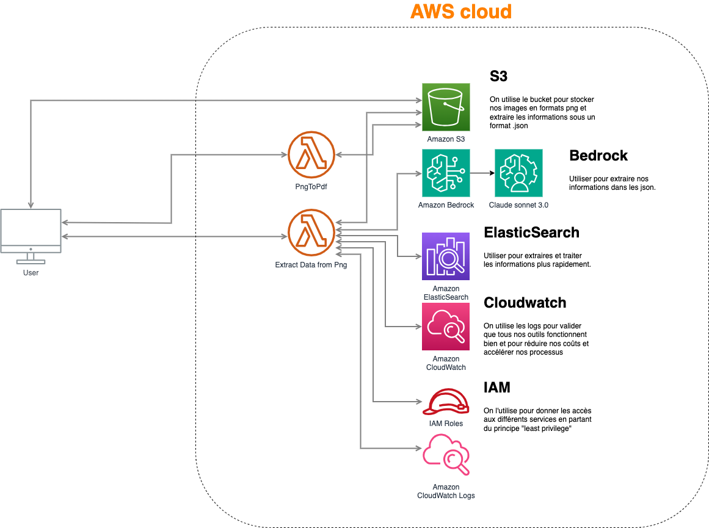

# 📊 Edge - Get an edge

## 🌟 Overview

**Stock Analysis** is a web application that allows users to analyze stocks using advanced machine learning models and financial tools. The application provides detailed insights into stock performance, technical analysis, fundamental analysis.

The analysis is conducted using a crew-based agent architecture, with a team consisting of:

- Senior Stock Market Researcher
- Senior Fundamental Analyst
- Expert Technical Analyst
- Chief Investment Strategist

These agents work together to analyze a ticker and produce the most comprehensive report possible. This structure is, of course, adaptable to the investment standards and theses of each bank or investor.

## ⚙️ Démo

[Accès à la version en ligne
](https://edge-agent-datathon.onrender.com/) (Serveur très lent, car gratuit)

## ✨ Features

- **📈 Interactive Stock Chart**: Visualize stock price data along with key technical indicators.
- **📊 Comprehensive Stock Analysis**: Get detailed reports on stock performance, including technical and fundamental analysis.
- **🤖 Model Selection**: Choose from multiple language models ( Sonnet 3.0, OpenAI GPT-4, Llama 3 8B, Groq Llama) for generating analysis reports.

## 🚀 Installation

### Prerequisites

- Python 3.7+
- Streamlit
- yFinance
- Plotly
- Langchain
- Praw
- CrewAI
- Required API keys

### Setup

1. Install the required packages using requirements.txt:

   ```sh
   pip install -r requirements.txt
   ```

2. Set up environment variables:
   Create a `.env` file in the project root and add the following environment variables:
   ```env
   SERPER_API_KEY=your_serper_api_key
   OPENAI_API_KEY=your_openai_api_key
   GROQ_API_KEY=your_groq_api_key
   AWS_REGION=us-west-2
   AWS_S3_BUCKET_NAME=pdf-raw-documents
   AWS_ACCESS_KEY_ID=your_aws_access_key_id
   AWS_SECRET_ACCESS_KEY=your_aws_secret_access_key
   ```

## 🛠️ Usage

### Running the Application

1. Start the Streamlit app:

   ```sh
   streamlit run app.py
   ```

2. Open your web browser

3. Use the sidebar to configure your analysis:

   - Select the language model.
   - Enter the stock symbol.
   - Choose the time period and indicators.

4. Click the "Analyze Stock" button to generate the report and visualize the stock data.

## 🏗️ AWS Architecture

Our AWS architecture consists of the following components:

### S3

Storage bucket used to:

- Store images in PNG format
- Extract information in JSON format

### Bedrock

Service used with Claude Sonnet 3.0 to run the crew of agents.

### ElasticSearch

Used to extract and process information more quickly.

### CloudWatch

Monitoring service that allows:

- Validation of proper tool functioning
- Cost reduction
- Process acceleration

### IAM

Access management for different services based on the "least privilege" principle.

The data flow goes through two Lambda functions:

1. PngToPdf: For initial conversion
2. Extract Data from Png: For data extraction



### Application Structure

- `app.py`: Contains the Streamlit application code for the user interface.
- `tools/`: Contains custom tools for sentiment analysis and financial data retrieval.

### Sources

[1] A. Smith, "Build a Financial Analyst Agent Using CrewAI and LlamaIndex," The AI Forum, 2023. [En ligne]. Disponible sur : https://medium.com/the-ai-forum/build-a-financial-analyst-agent-using-crewai-and-llamaindex-6553a035c9b8. [Consulté le 4 novembre 2024].

[2] J. Doe, "Financial Analysis Multi-Agent with Open-Source LLMs Using CrewAI and Ollama Models," Generative AI Pub, 2023. [En ligne]. Disponible sur : https://generativeai.pub/financial-analysis-multi-agent-with-open-source-llms-using-crewai-and-ollama-models-9f20076f8995. [Consulté le 4 novembre 2024].

[3] G. Peter, "Making LLM Optimization Simple: The Magic of Streamlined Prompt Engineering and More," Medium, 2023. [En ligne]. Disponible sur : https://medium.com/@gabrielpeter2090/making-llm-optimization-simple-the-magic-of-streamlined-prompt-enginee-ring-and-more-%EF%B8%8F-b1baf4158da8. [Consulté le 4 novembre 2024].

[4] B. Senerr, "AI-Powered Financial Analysis: Multi-Agent Systems Transform Data into Insights," Medium, 2023. [En ligne]. Disponible sur : https://medium.com/@batuhansenerr/ai-powered-financial-analysis-multi-agent-systems-transform-data-into-insights-d94e4867d75d. [Consulté le 4 novembre 2024].

[5] R. Brown, "Unleashing AI in Finance: Your Secret Weapon as a Financial Analyst," AI Hub, 2023. [En ligne]. Disponible sur : https://medium.com/ai-hub/unleashing-ai-in-finance-your-secret-weapon-as-a-financial-analyst-90a3b0c41f6f. [Consulté le 4 novembre 2024].

[6] T. Twins, "Large Language Models as Financial Analysts," Magic AI, 2024. [En ligne]. Disponible sur : https://medium.com/magic-ai/large-language-models-as-financial-analysts-879c1d6b8e73. [Consulté le 4 novembre 2024].
